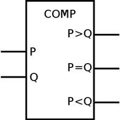

The aim of this experiment is to understand and implement digital comparator circuits used in digital systems for magnitude comparison operations.

### What you will learn:

Through this interactive experiment, you will:

- **Understand the fundamentals** of digital comparison in binary systems
- **Design and analyze** 1-bit comparator circuits for basic magnitude comparison
- **Construct multi-bit comparators** that can compare larger binary numbers
- **Implement cascading techniques** to build n-bit comparators from smaller units
- **Explore real-world applications** of comparators in processors, control systems, and digital circuits

### Why are comparators important?

Digital comparators are essential building blocks in digital systems. They are fundamental components not only in arithmetic logic units (ALUs), but also in control circuits, sorting algorithms, decision-making systems, and conditional operations in processors. Understanding comparator circuits will give you insight into how computers perform logical comparisons and make decisions based on numerical relationships.

