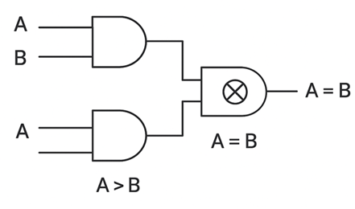
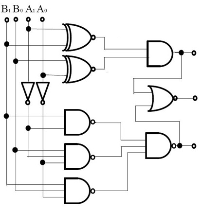
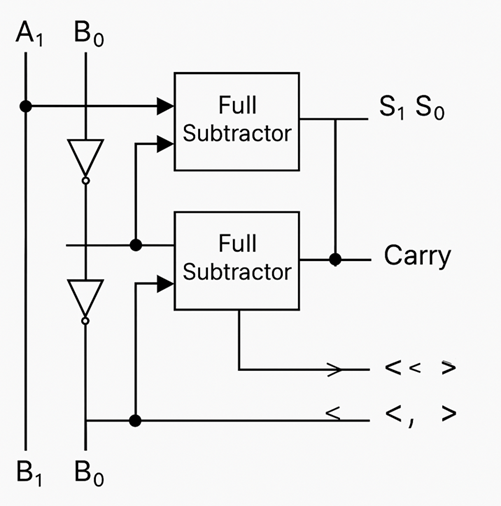

### 1-bit Comparator

#### Circuit Diagram

_Figure 1: 1-bit Comparator circuit diagram showing logic gates for A > B, A = B, and A < B outputs. Reference: Theory section_

#### Components Required

- 4 AND gates
- 1 OR gate
- 2 NOT gates

#### Circuit Connections

1. Drag the first NOT gate and connect its input with B input. This creates B̄ (NOT B).
2. Drag the first AND gate and connect its inputs with A input and the output of the first NOT gate (B̄). Connect its output with the A > B output bit.
3. Drag the second NOT gate and connect its input with A input. This creates Ā (NOT A).
4. Drag the second AND gate and connect its inputs with the output of the second NOT gate (Ā) and B input. Connect its output with the A < B output bit.
5. Drag the third AND gate and connect its inputs with A input and B input.
6. Drag the fourth AND gate and connect its inputs with outputs of both NOT gates (Ā and B̄).
7. Drag the OR gate and connect its inputs with outputs of the third and fourth AND gates. Connect its output with the A = B output bit.
8. Set the values of A and B inputs and click "Simulate" to observe the comparison results.

#### Observations

- Only one of the three outputs (A > B, A = B, A < B) will be high (1) at any given time.
- A > B output is high when A = 1 and B = 0.
- A = B output is high when both A and B have the same value (both 0 or both 1).
- A < B output is high when A = 0 and B = 1.
- If the circuit has been constructed correctly, a "Success" message will be displayed upon clicking "Submit".

### 2-bit Comparator (Direct Logic Implementation)

#### Circuit Diagram

_Figure 2: 2-bit Comparator circuit diagram showing hierarchical comparison logic for A₁A₀ vs B₁B₀. Reference: Theory section_

#### Components Required

- 2 XNOR gates
- 6 AND gates
- 2 OR gates
- 2 NOT gates

#### Circuit Connections

**For A = B Output:**

1. Drag the first XNOR gate and connect its inputs with A₁ and B₁ input bits.
2. Drag the second XNOR gate and connect its inputs with A₀ and B₀ input bits.
3. Drag an AND gate and connect its inputs with outputs of both XNOR gates. Connect its output with the A = B output bit.

**For A > B Output:** 4. Drag the first NOT gate and connect its input with B₁ input bit. 5. Drag an AND gate and connect its inputs with A₁ input and output of the first NOT gate. This represents A₁B₁'. 6. Drag the second NOT gate and connect its input with B₀ input bit. 7. Drag an AND gate and connect its inputs with A₀ input and output of the second NOT gate. This represents A₀B₀'. 8. Drag an AND gate and connect its inputs with outputs of both XNOR gates and the A₀B₀' term from step 7. 9. Drag an OR gate and connect its inputs with outputs from steps 5 and 8. Connect its output with the A > B output bit.

**For A < B Output:** 10. Drag the third NOT gate and connect its input with A₁ input bit. 11. Drag an AND gate and connect its inputs with output of the third NOT gate and B₁ input. This represents A₁'B₁. 12. Drag the fourth NOT gate and connect its input with A₀ input bit. 13. Drag an AND gate and connect its inputs with output of the fourth NOT gate and B₀ input. This represents A₀'B₀. 14. Drag an AND gate and connect its inputs with outputs of both XNOR gates and the A₀'B₀ term from step 13. 15. Drag an OR gate and connect its inputs with outputs from steps 11 and 14. Connect its output with the A < B output bit. 16. Set the values of A₁, A₀, B₁, and B₀ inputs and click "Simulate".

#### Observations

- A = B output is high when binary number A₁A₀ equals B₁B₀, and the other two outputs show 0.
- A > B output is high when binary number A₁A₀ is greater than B₁B₀, and the other two outputs show 0.
- A < B output is high when binary number A₁A₀ is less than B₁B₀, and the other two outputs show 0.
- The MSB comparison takes priority over LSB comparison.
- If the circuit has been constructed correctly, a "Success" message will be displayed upon clicking "Submit".

### 2-bit Comparator Using Subtractor

#### Circuit Diagram

_Figure 3: 2-bit Comparator using Subtractor approach showing full adders with input inversions for A₁A₀ - B₁B₀ operation. Reference: Theory section_

#### Components Required

- 2 Full Adders
- 2 XOR gates (for B input inversion)
- 2 NOT gates (for result analysis)
- 1 AND gate (for equality detection)

#### Circuit Connections

**Subtractor Implementation:**

1. Drag the first XOR gate and connect its inputs with B₀ input and logic 1 (VCC). This inverts B₀.
2. Drag the second XOR gate and connect its inputs with B₁ input and logic 1 (VCC). This inverts B₁.
3. Drag the first Full Adder and connect:
   - A input with A₀
   - B input with output of first XOR gate (B₀')
   - Cin with logic 1 (for 2's complement +1)
   - Sum output labeled as S₀
   - Cout connected to Cin of second Full Adder
4. Drag the second Full Adder and connect:
   - A input with A₁
   - B input with output of second XOR gate (B₁')
   - Cin with Cout from first Full Adder
   - Sum output labeled as S₁
   - Cout labeled as C₁

**Comparison Output Generation:** 5. Drag the first NOT gate and connect its input with S₀. 6. Drag the second NOT gate and connect its input with S₁. 7. Drag an AND gate and connect its inputs with outputs of both NOT gates. Connect its output with A = B output bit. 8. Connect C₁ directly to A > B output bit. 9. Drag a NOT gate and connect its input with C₁. Connect its output with A < B output bit. 10. Set the values of A₁, A₀, B₁, and B₀ inputs and click "Simulate".

#### Observations

- The subtractor performs A₁A₀ - B₁B₀ using 2's complement arithmetic.
- A = B output is high when the subtraction result S₁ S₀ = 00 (zero result).
- A > B output is high when carry C₁ = 1 (no borrow occurred, positive result).
- A < B output is high when carry C₁ = 0 (borrow occurred, negative result).
- This method demonstrates the relationship between arithmetic and comparison operations.
- If the circuit has been constructed correctly, a "Success" message will be displayed upon clicking "Submit".

### Testing Procedures

#### 1-bit Comparator Testing

**Test Case 1:** A = 0, B = 0

- Expected: A = B = 1, A > B = 0, A < B = 0

**Test Case 2:** A = 0, B = 1

- Expected: A = B = 0, A > B = 0, A < B = 1

**Test Case 3:** A = 1, B = 0

- Expected: A = B = 0, A > B = 1, A < B = 0

**Test Case 4:** A = 1, B = 1

- Expected: A = B = 1, A > B = 0, A < B = 0

#### 2-bit Comparator Testing

**Test Case 1:** A₁A₀ = 01, B₁B₀ = 10

- Expected: A = B = 0, A > B = 0, A < B = 1 (1 < 2)

**Test Case 2:** A₁A₀ = 11, B₁B₀ = 10

- Expected: A = B = 0, A > B = 1, A < B = 0 (3 > 2)

**Test Case 3:** A₁A₀ = 10, B₁B₀ = 10

- Expected: A = B = 1, A > B = 0, A < B = 0 (2 = 2)

#### Troubleshooting

- **No Output Active**: Check that all gate connections are properly made and inputs are set correctly.
- **Multiple Outputs Active**: Verify the logic gate connections, particularly the NOT gates and their connections.
- **Incorrect Comparison Results**: For 2-bit comparator, ensure XNOR gates are used for bit equality and priority logic is correctly implemented.
- **Subtractor Method Issues**: Verify that B inputs are properly inverted and the +1 for 2's complement is applied to the first Full Adder's Cin.
