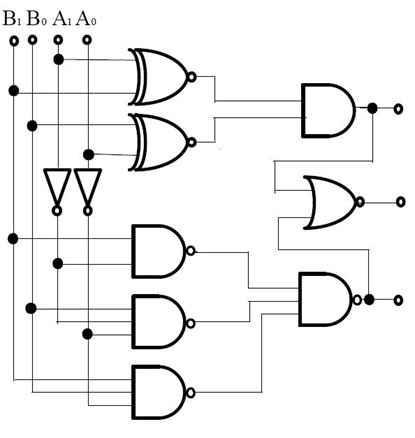
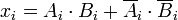
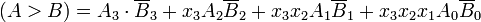
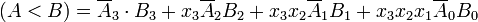

The operation of a single bit digital comparator can be expressed as a truth table:

**InputsOutputs**

|A  |	B  |	A > B |	A = B |	A < B|
|---|------|----------|-------|------|
|0  |	0  |	0     |	1     |	0    |
|0  |	1  |	0     |	0     | 1    |
|1  | 	0  | 	1     | 0     | 0    |
|1  |   1  | 	0     |	1     |	0    |

The operation of a two bit digital comparator cannot be expressed as a truth table: 

**Inputs 	Outputs**

|A1|A01|  B0 | A < B| A = B| A > B|
|-------------|-------------|--------------|----------------|------|------|------|
|0 	      |	0 	    |	0 	   |  	0 	    |	0  |	1 |	0|
|0 	      |	0 	    | 	0 	   |	1 	    |	1  |	0 |	0|
|0 	      |	0 	    |	1 	   |	0 	    |	1  |	0 |	0|
|0 	      |	0 	    |	1 	   |	1 	    |	1  |	0 |	0|
|0 	      |	1 	    |	0 	   |	0 	    |	0  |	0 |	1|
|0 	      |	1 	    |	0 	   |	1 	    |	0  |	1 |	0|
|0 	      |	1 	    |	1 	   |	0 	    |	1  |	0 |	0|
|0 	      |	1 	    |	1 	   |	1 	    |	1  |	0 |	0|
|1 	      |	0 	    |	0 	   |	0 	    |	0  | 	0 |	1|
|1 	      |	0 	    |	0 	   |	1 	    |	0  |	0 |	1|
|1 	      |	0 	    |	1 	   |	0 	    |	0  |	1 |	0|
|1 	      |	0 	    |	1 	   |	1 	    |	1  |	0 |	0|
|1 	      |	1 	    | 	0 	   |	0 	    |	0  |	0 |	1|
|1 	      |	1 	    |	0 	   |	1 	    |	0  |	0 |	1|
|1 	      |	1 	    |	1 	   |	0 	    |	0  |	0 |	1|
|1 	      |	1 	    |	1 	   |	1 	    |	0  |	1 |	0|

Following is the circuit digram for the two bit comparator : 

**Implementation**

A = A3A2A1A0

B = B3B2B1B0

Here each subscript represents one of the digits in the numbers.

**Equality**

The binary numbers A and B will be equal if all the pairs of significant digits of both numbers are equal, i.e.,

A3 = B3, A2 = B2, A1 = B1 and A0 = B0

Since the numbers are binary, the digits are either 0 or 1 and the boolean function for equality of any two digits Ai and Bi can be expressed as

xi is 1 only if Ai and Bi are equal.

For the equality of A and  B, all xi variables (for i=0,1,2,3) must be 1.

So the quality condition of A and B can be implemented using the AND operation as

(A = B) = x3x2x1x0

The binary variable (A=B) is 1 only if all pairs of digits of the two numbers are equal.

**Inequality**

In order to manually determine the greater of two binary numbers, we inspect the relative magnitudes of pairs of significant digits, starting from the most significant bit, gradually proceeding towards lower significant bits until an inequality is found. When an inequality is found, if the corresponding bit of A is 1 and that of B is 0 then we conclude that A>B.

This sequential comparison can be expressed logically as:

(A>B) and (A < B) are output binary variables, which are equal to 1 when A>B or A<B respectively.

 
